# Revisión de octubre — recorrido

Lo que Wendy va marcando, tal cual, antes del análisis. El plan va aparte.

## Recursos (banca de recursos) y audios del chat

**1. Grabar un audio en Recursos no se puede guardar** — 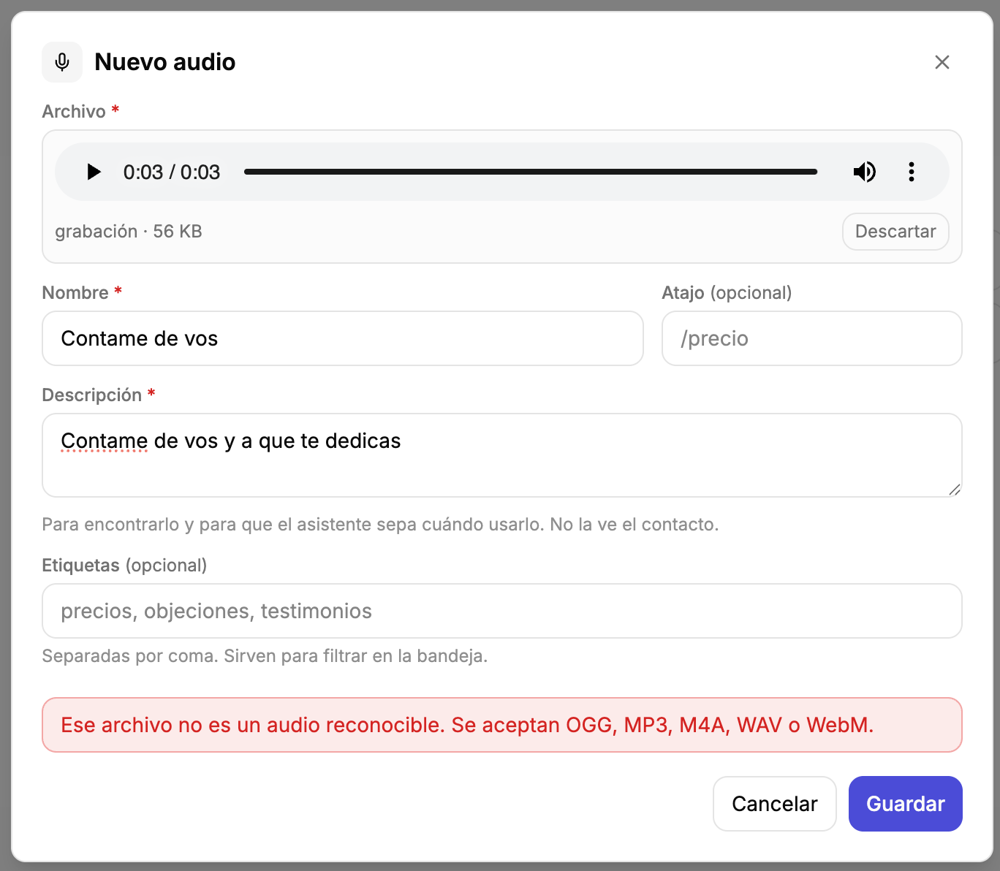
- **1a.** En "Nuevo audio" se puede grabar en el momento, pero al apretar Guardar aparece "Ese archivo no es un audio reconocible. Se aceptan OGG, MP3, M4A, WAV o WebM." Lo grabado tiene que guardarse en un formato que se acepte.
- **1b. Duda: ¿cómo funciona hoy la transcripción y cuándo se hace?** Ideas: transcribir en el momento; una cajita para escribirla a mano; si es obligatoria, un botón "Transcribir con IA". ¿Hay que esperar a que termine para poder guardar? No está claro cuál es el mejor flujo.
- **1c. Lo mismo para los audios que se mandan desde la bandeja:** tienen que salir en un formato que acepten las dos integraciones (Zernio para Instagram, Evolution API para WhatsApp).
- **1d.** Una vez mandado desde la bandeja, el audio tiene que quedar guardado en la base y transcripto. Hay que entender cómo funciona eso hoy.

## Ajustes → pestaña Contenido (pilares y ofertas)

**2. Ofertas pasan a ser Productos, y los pilares se van a Contenido** — 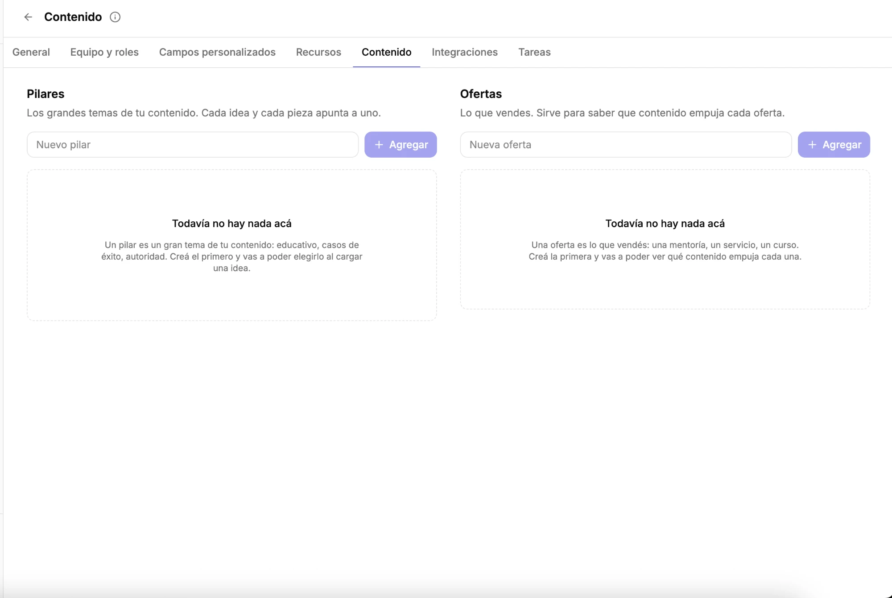
- **2a.** La pestaña "Contenido" de Ajustes pasa a llamarse **"Productos"**.
- **2b.** "Ofertas" pasa a ser **"Productos"**. Cada producto tiene siempre un **precio** y un **estado**: activo, inactivo o discontinuado.
- **2c.** Los **pilares** salen de Ajustes y van a la **página de Contenido**, detrás de un botón de ajustes (una tuerquita ⚙️). Ahí después se pueden sumar otros ajustes de contenido; por ahora solo los pilares.

## Automatizaciones

**3. Usar los recursos en las automatizaciones** (sin screenshot)
- Los recursos de la banca (texto, audio, video, imagen, archivo, enlace) tienen que poder usarse en las automatizaciones: en los mensajes automáticos y también en los correos.

## Integraciones → Gmail

**4. Terminar la integración de Gmail** (sin screenshot) — *probablemente grande*
- **4a.** Terminar la integración de Gmail.
- **4b. Duda:** ¿la conexión con Google que ya existe (la de YouTube) sirve para entrar a Gmail, o Gmail va por separado? Tiene que poder conectarse **más de una cuenta de Gmail**.
- **4c. Duda:** ¿esto ya está hecho, planeado o hay que planificarlo de cero? Wendy lo ve como una funcionalidad completa.

## Agenda (lista de reuniones)

**5. La barra de arriba de Agenda** — 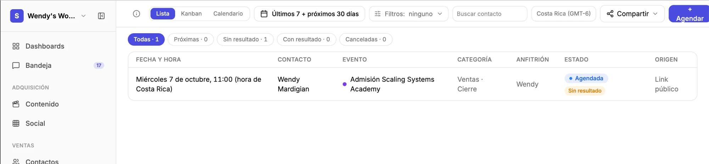
- **5a.** Arreglar la barra de arriba en general. *(El dictado decía "la IVA"; se interpreta como "la barra". A confirmar.)*
- **5b.** El botón **"+ Agendar"** se ve mal: el "+" queda arriba del texto y el botón se corta contra el borde derecho.
- **5c.** El chip de zona horaria **"Costa Rica (GMT-6)"** lleva a Ajustes al hacerle clic, pero no parece un botón. Wendy duda de que haga falta que sea un botón.
- **5d.** **Filtros** pasa a ser un botón de solo ícono, con un badge (globito) con la cantidad de filtros aplicados cuando hay alguno.
- **5e.** El **filtro de fecha** queda afuera del botón de filtros (eso está bien), pero el desplegable está muy apretado, sobre todo el calendario. Necesita más espacio.
- **5f.** El desplegable de fecha tiene que **cerrarse solo al hacer clic afuera**.
- **5g.** El **buscador** pasa a ser solo un ícono de lupa que se expande al hacerle clic. Si hay un filtro de fecha aplicado, un tooltip (cartelito) avisa que la búsqueda se limita a ese rango de fechas.

## Contactos

**6. La lista de contactos: todo en una sola barra** — 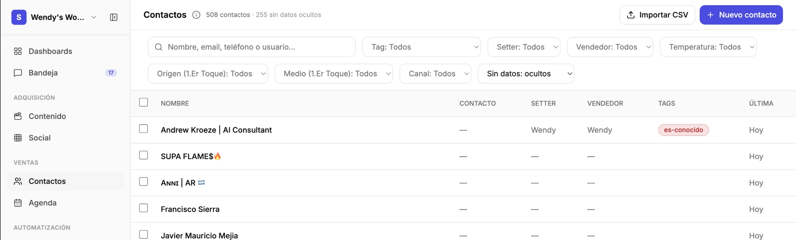
- **6a.** El buscador y los filtros ocupan dos filas enteras abajo del título. Todo tiene que subir a la **misma barra** del título "Contactos", junto a "Importar CSV" y "Nuevo contacto".
- **6b.** En esa barra: el **buscador**, un **botón de ícono de filtros** que abre un desplegable con todos los filtros (tag, setter, vendedor, temperatura, origen y medio del 1er toque, canal, sin datos), y los **ajustes de la tabla**, como "ordenar por".
- *(Relacionado con 5: mismo patrón de barra que Agenda. Conviene que las dos queden iguales.)*

**7. Ficha del contacto: orden de las secciones** (sin screenshot)
- **7a.** En la columna principal, **Notas** va arriba de todo, antes de Conversaciones.
- **7b.** En la columna derecha, **Tags** va debajo de Seguimiento y arriba de Acciones rápidas.

**8. Historial del contacto: que aparezca todo lo automático** (sin screenshot)
- Todo lo que dispara una automatización sobre ese contacto tiene que aparecer en el **historial**, incluidos los emails que manda una automatización.
- Los mensajes de chat no hacen falta en el historial, porque ya salen en Conversaciones.
- **Duda:** ¿los emails salientes ya salen en Conversaciones? Si salen, no hace falta repetirlos en el historial, salvo que los haya mandado una automatización.

## Agentes (sección de IA) y topes de gasto

**9. Los topes de gasto de IA, ligados a Agentes** — 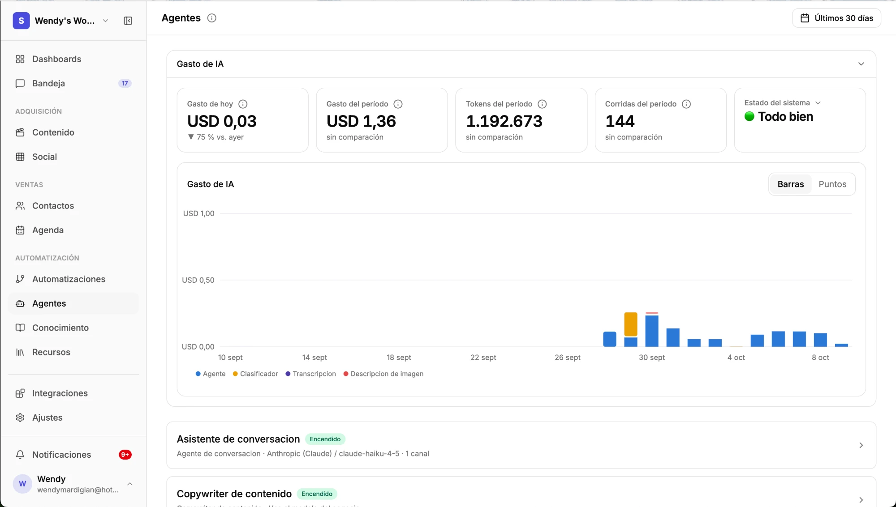 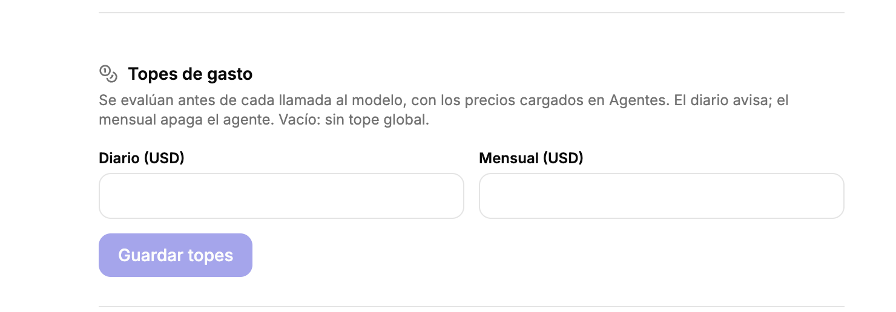
- **9a.** Wendy ve "Agentes" como **la sección de IA en general**. El bloque "Gasto de IA" está perfecto.
- **9b.** Los **topes diario y mensual** hoy están en Ajustes generales. Tienen que estar **ligados a Agentes**. Opciones que ella misma plantea: que se definan en Agentes; que estén en los dos lados sincronizados; o que Agentes los muestre con un botón para ir a configurarlos en Ajustes. Lo importante es que estén conectados.
- **9c.** Hoy "el diario avisa; el mensual apaga el agente". Wendy quiere que **el diario también pueda apagar**, o al menos que sea configurable.
- **9d.** Propuesta: el tope **apaga**, y aparte hay un **aviso configurable al llegar a un X % del tope** (el porcentaje lo elige el usuario). Lo esperaría configurado ahí mismo, junto a los topes.
- **9e.** Condición: si más adelante hay un **ajuste general de notificaciones**, este aviso también tiene que aparecer ahí (repetido o ligado), para que **todas las notificaciones queden centralizadas en un solo lugar**.
- **Duda:** qué tan complejo es y dónde conviene poner el ajuste del aviso.

## Ajustes generales: cosas que no van ahí

**10. "Visibilidad de leads" se va a Roles** — 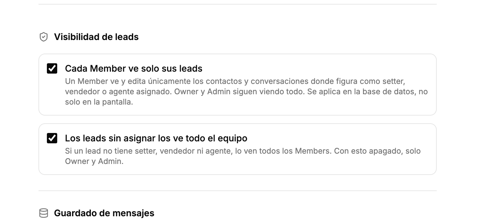 — *delicado: toca permisos y RLS*
- **10a.** El bloque "Visibilidad de leads" de Ajustes generales ("Cada Member ve solo sus leads" y "Los leads sin asignar los ve todo el equipo") **sale de ahí**. Es un tema de **roles**.
- **10b.** En la pantalla de Roles, cuando a un rol se le da el permiso de ver **Contactos**, se elige también el **alcance**: **solo los asignados** o **todos**. Se define **rol por rol**.
- **10c.** Valores por defecto: **Member** ve solo los asignados; **Admin** ve todo, siempre.
- **10d.** Aplica igual para **Contactos** y para **Agenda**.
- *(Wendy anticipa que hay más cosas en Ajustes generales que no deberían estar ahí; esta es la primera.)*
- **A revisar:** qué pasa con "los leads sin asignar los ve todo el equipo" en el modelo por rol, y cómo se pasa lo que hay hoy al modelo nuevo sin que nadie pierda ni gane acceso por accidente.

**11. "Guardado de mensajes" deja de ser opcional** — 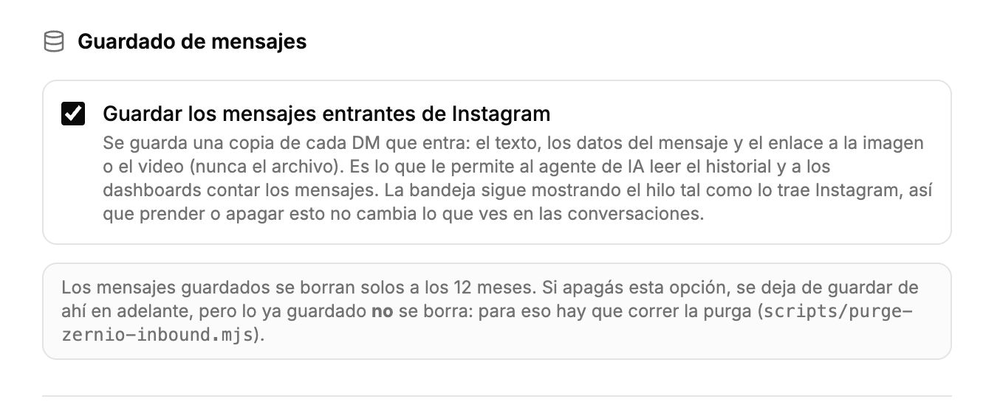
- **11a.** Se **quita** de Ajustes generales la opción "Guardar los mensajes entrantes de Instagram" (hoy `workspaces.persist_zernio_inbound`).
- **11b.** Los mensajes de **todos los canales conectados** (Instagram por Zernio, WhatsApp por Evolution y cualquier otro) **se guardan siempre**, sin opción para apagarlo.
- **11c.** Lo mismo para los **comentarios**: se guardan siempre.
- **11d. A comprobar:** que los comentarios **de verdad se estén guardando hoy**.
- **A revisar:** el aviso de esa sección dice que los mensajes se borran solos a los 12 meses. Ver si esa retención sigue igual una vez que guardar es obligatorio.

**12. "Escalado por mensaje sin entender" se va al asistente de conversación** — 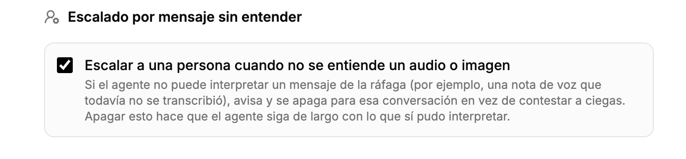
- **12a.** La opción "Escalar a una persona cuando no se entiende un audio o imagen" (hoy `workspaces.agent_escalate_on_unreadable`) no es un ajuste general: es del **agente de chat**.
- **12b.** Se mueve a los **ajustes del "Asistente de conversación"**, dentro de Agentes, y sale de Ajustes generales.
- **Duda:** ¿por qué quedó en Ajustes generales? Ver si es por workspace a propósito (por ejemplo, porque la compuerta del runner la lee de `workspaces`) y si pasarla al agente cambia algo de cómo funciona.

## Integraciones → Zernio

**13. La pestaña "Cuentas" de Zernio = la página de Canales** — 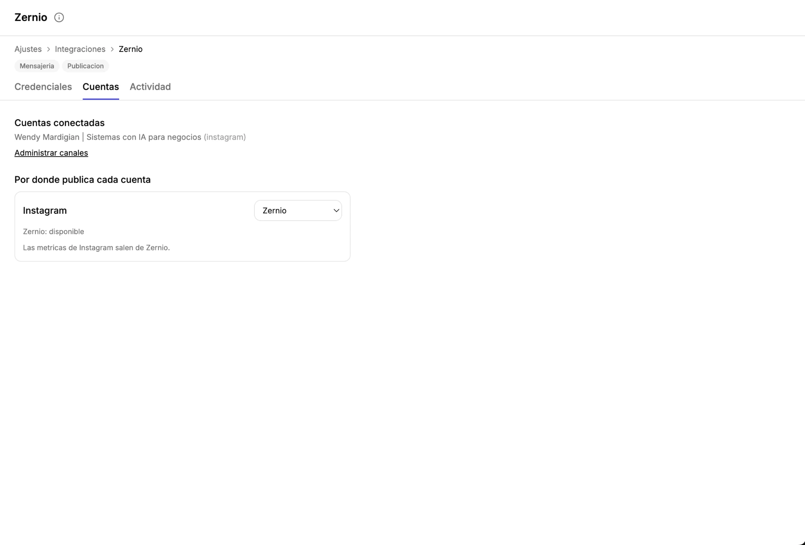 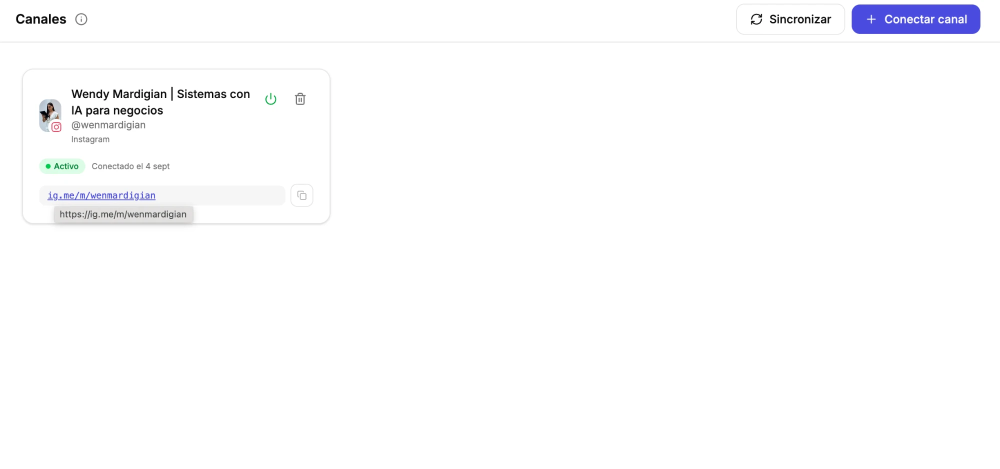
- **13a.** Hoy la pestaña **Cuentas** muestra una lista de texto de las cuentas conectadas, el link "Administrar canales" y "Por donde publica cada cuenta".
- **13b.** Lo que muestra la página de **Canales** (a la que lleva "Administrar canales") tiene que estar **adentro de la pestaña Cuentas**: las tarjetas de los canales conectados (foto, @, estado, link ig.me, apagar y borrar), "Sincronizar" y "Conectar canal".
- **13c.** Para Wendy, "cuentas" y "canales" son lo mismo.
- **A revisar:** qué pasa con "Por donde publica cada cuenta" (¿se queda en la misma pestaña?), si la página de Canales sigue existiendo aparte (ahí también está WhatsApp/Evolution, que no es de Zernio), y si Evolution tiene que quedar igual.

## Contactos → ficha (otra vez)

**14. Editar el contacto desde la ficha, sin pantalla aparte** — 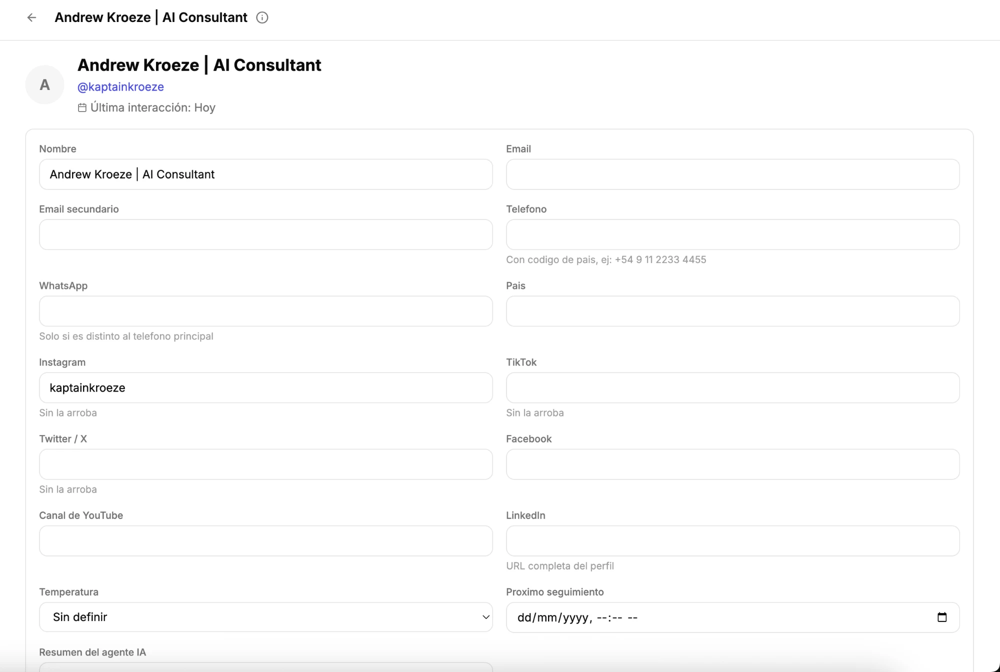
- **14a. Bug:** el botón "Editar" de la ficha lleva a una página de edición que **no tiene scroll**, así que no se llega a ver todo (abajo queda "Resumen del agente IA" cortado).
- **14b.** Esos datos (nombre, email, email secundario, teléfono, WhatsApp, país, Instagram, TikTok, Twitter/X, Facebook, canal de YouTube, LinkedIn, temperatura, próximo seguimiento, resumen del agente IA) son importantes y tienen que **verse en la ficha** sin apretar Editar.
- **14c.** Se tienen que poder **editar ahí mismo** (edición en línea), sin pasar por el botón Editar. Incluido el **nombre del título**: al hacerle clic, se edita.
- *(Relacionado con 7: el reordenamiento de la ficha y esto se hacen juntos.)*

## Dashboards

**15. Sacar "Gasto de IA" y sumar un dashboard de Agenda** — 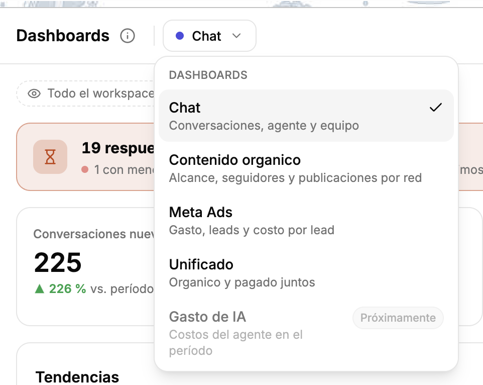
- **15a.** Quitar "Gasto de IA" (hoy "Próximamente") del selector de dashboards: eso vive en Agentes.
- **15b.** Sumar un **dashboard de Agenda**, básico para empezar: total de agendas y **contactos que agendaron** (no es lo mismo), por **atribución** (UTMs), por **categoría**, por **responsable** y por **estado**.
